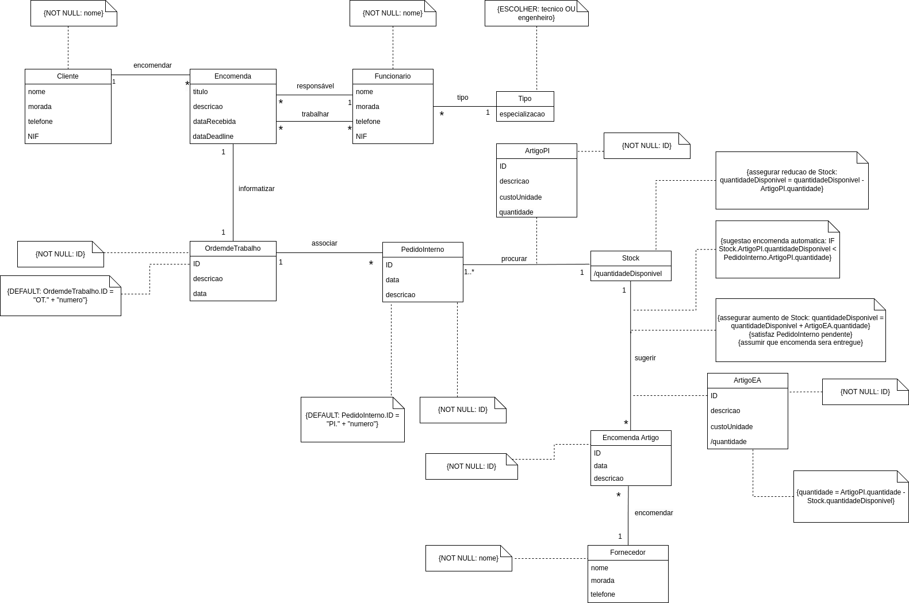

# Y2S1-DataBase Project

This repository contains the source code and documentation for an Engineering Company Warehouse Management System, a project developed by Álvaro Luís Dias Amaral Alvim Torres, Beatriz Filomena Remondes de Oliveira and 
Manoela Blanke Américo for the subject of Data Base. The system serves as a computerized backbone to efficiently manage the stock of parts and components utilized in various engineering projects, equipment maintenance, and related services within the company's workshop.

<h2>Project Overview</h2>
The primary objective of this project is to streamline the inventory management process within the company's warehouse. Key functionalities and features of the system include: 
 
 
  <ul>
    <li><strong>Customer Order Management:</strong> Recording and processing customer orders, including customer details, order descriptions, and deadlines.</li>
    <li><strong>Employee Management:</strong> Detailed information about each employee, their roles (technician or engineer), and assignment of orders.</li>
    <li><strong>Work Order Generation:</strong> Creation of specific work orders for each customer order, detailing project descriptions and creation dates.</li>
    <li><strong>Inventory Management:</strong> Tracking stock levels of parts and components, generating internal requests for items needed to fulfill orders, and suggesting item orders when stock is insufficient.</li>
</ul>
<h2>UML Class Diagram Model</h2>

  

